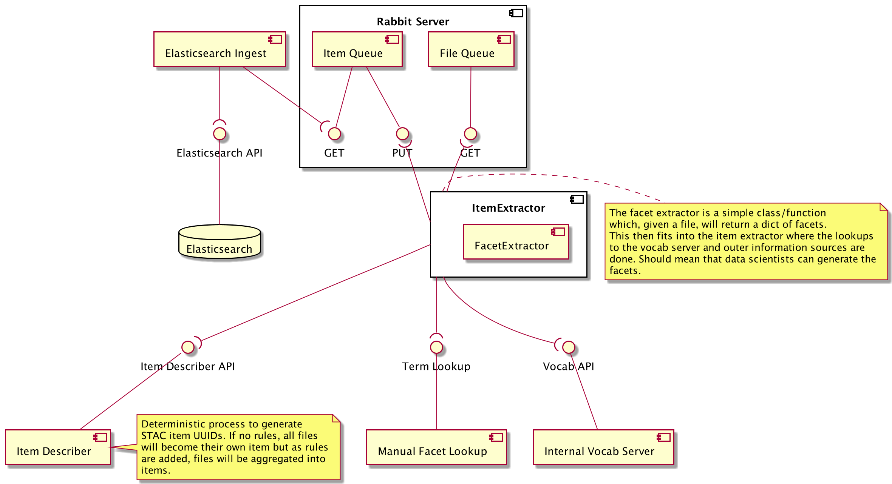

# search-futures

## Key Repositories and Development Strands

### Indexing

- [Asset Scanner](https://github.com/cedadev/asset-scanner) - Asset scanning framework. Provides the input/output plugins, item-description interface and holds shared utilities.
- [Asset Generator](https://github.com/cedadev/asset-generator) - Converts a stream of URIs (filepaths) into assets. Outputs Asset dictionary and `tuple(<item_id>,<filepath>)`
- [Item Generator](https://github.com/cedadev/item-generator) - Summarises Assets to form Items. Can also run its own processors to enrich the item content.  Input is a stream of `item_id`s and `filepaths`. Outputs `Item` and `tuple(<collection_id>,<filepath>)`
- [Collection Generator](https://github.com/cedadev/collection-generator) - Summarises Items to form Collections. Can also run its own processors to enrich the Collection content. Input is a stream of `collection_id`s and `filepaths`. Outputs `Collections`
- [Item Descriptions](https://github.com/cedadev/item-descriptions) - Configuration files for the indexing workflow. They describe how to construct the assets, items and collections. 
- [Item Descriptions Deployment](https://breezy.badc.rl.ac.uk/stac/stac-item-descriptions) - Descriptions are also pushed here to build a data container for the indexing process.
- [Asset Scanner Example](https://github.com/cedadev/asset-scanner-example) - Example repo which launches in Binder to demonstrate the indexing workflow.
- [STAC Indexing Deployment](https://breezy.badc.rl.ac.uk/stac/stac-indexer-deploy) -  Deployment of the STAC indexers in Kubernetes.

### API

- [Server Implementation](https://github.com/cedadev/stac-fastapi-elasticsearch) - Our Elasticsearch implementation of the STAC API
- [Deployment](https://breezy.badc.rl.ac.uk/stac/stac-fastapi-elasticsearch-deploy) - Deployment for the API server
- Extensions:
  - filter - Built in extension to provide faceted search and more advanced queries based on [CQL2](https://portal.ogc.org/files/96288#filter-queryables) 
  Elasticsearch queries made possible through [pygeofilter-elasticsearch](https://github.com/cedadev/pygeofilter-elasticsearch).
  - [free-text](https://github.com/cedadev/stac-freetext-search) - OpenAPI Schema to describe the API extension. Adds `q` parameter to search.
  - [free-text-ext](https://github.com/cedadev/stac-free-text-ext) - Extension classes to use with the STAC FastAPI framework
  - [context-collections](https://github.com/cedadev/stac-context-collections) - OpenAPI Schema to describe the API extension. Adds collection IDs in the context response.  
  - [context-collections-ext](https://github.com/cedadev/stac-context-collection-ext) -  Extension classes to use with the STAC FastAPI framework.
  - [asset-search](https://github.com/cedadev/stac-asset-search) -  OpenAPI Schema to describe the API extension. Adds `/assets/search` endpoint.
  - [asset-list](https://github.com/cedadev/stac-asset-list/blob/main/README.md) - OpenAPI Schema to describe the API extension. Addes `/collections/<collectionId>/items/<itemId>/assets`
  - [discoverable-facets](https://github.com/cedadev/search-futures/issues/79) -  Not yet created
- [Asset Spec](https://github.com/cedadev/stac-asset-spec) - Draft specification for assets

### UI
- [Application](https://github.com/cedadev/stac-ui) - ReactJS application to serve as a demo UI for STAC
- [Deployment](https://breezy.badc.rl.ac.uk/stac/stac-ui-deploy) -  Deployment of STAC UI in kubernetes

### Vocabularies
- [Vocabulary Generator](https://github.com/cedadev/stac-vocab) -  Generates vocabulary and mapping to canonical CEDA vocab from different source vocabs.
- [Vocabulary API](https://github.com/cedadev/stac-vocab-api) - API server to allow search for vocabs
- [Deployment]()

### Upstream Repos to keep an eye on
- [stac-fastapi](https://github.com/stac-utils/stac-fastapi) - The framework for the STAC API Server
- [pygeofilter](https://github.com/geopython/pygeofilter) -  Constructs abstract syntax trees (AST) from CQL queries. 

## Early UML Architecture Diagrams

NOTE: PlantUML was used to generate diagrams.

### Search API Interfaces and Middleware

### Media Crawler and Ingest

### Facet Extraction

